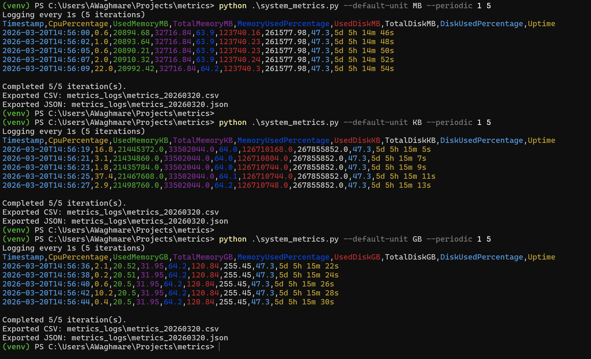
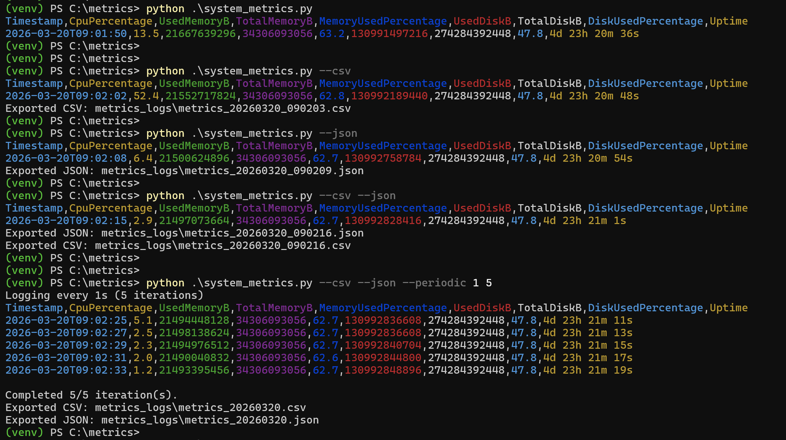
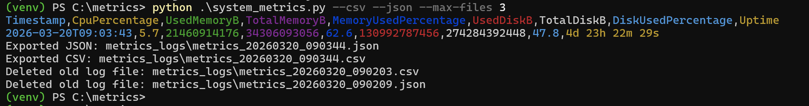
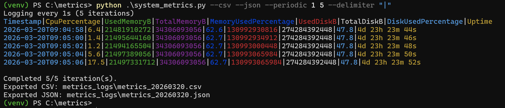
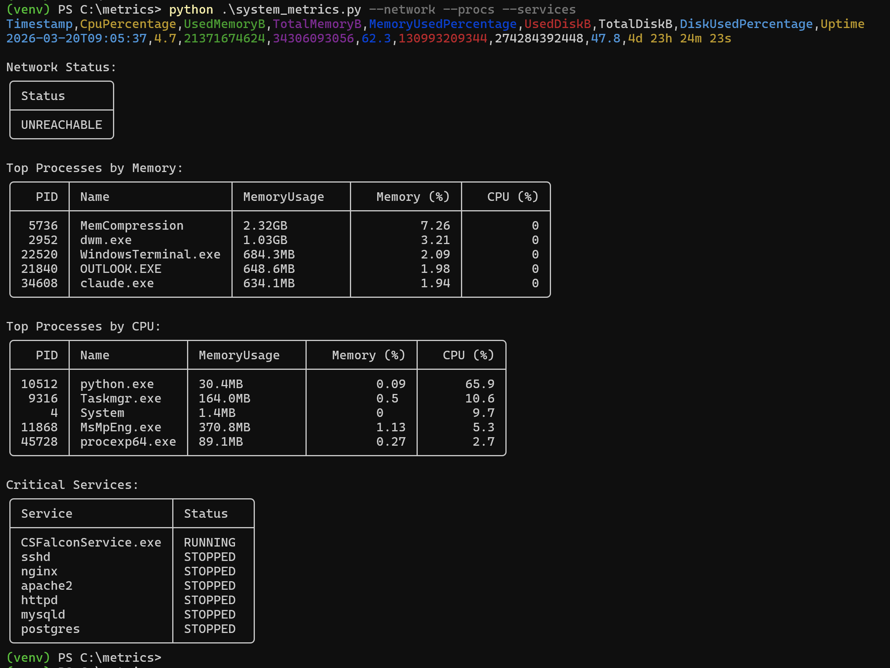

# System Metrics Collector

A cross-platform CLI tool for collecting real-time CPU, memory, disk, uptime, network, and process metrics. Supports Windows, Linux, and macOS.

## Dependencies

**Python**: 3.10+

Install all dependencies:

```bash
pip install -r requirements.txt
```

| Package | Version | Purpose |
|---------|---------|---------|
| `psutil` | 7.2.2 | System and process metrics (CPU, memory, disk, uptime, processes) |
| `tabulate` | 0.10.0 | Formatted table rendering for processes and services |
| `colorama` | 0.4.6 | Colorized, column-coded console output |
| `pytest` | 9.0.2 | Test runner (dev dependency) |

## Features

- **CPU usage** – percentage sampled over a 1-second interval
- **Memory usage** – used/total bytes and percentage of virtual memory
- **Disk usage** – used/total bytes and percentage for the system drive (~`C:\` on Windows, `/` elsewhere)
- **System uptime** – time since last boot, formatted as `Xd Xh Xm Xs`
- **Network connectivity check** (`--network`) – TCP probe to a DNS server (configurable in `config.py`, default `8.8.8.8:53`)
- **Top processes** (`--procs [N]`) – top N processes ranked by both memory and CPU usage, displayed as bordered tables
- **Critical services check** (`--services`) – running/stopped status for configurable service/process names (see `config.py`)
- **Unit conversion** (`--default-unit`) – output memory/disk values in B (raw bytes), KB, MB, or GB
- **CSV export** (`--csv`) – writes flat metrics to a timestamped CSV file in `metrics_logs/`
- **JSON export** (`--json`) – writes metrics as a compact NDJSON line to a timestamped JSON file in `metrics_logs/`
- **Periodic collection** (`--periodic INTERVAL COUNT`) – collect metrics on a fixed interval for a set number of iterations, auto-exporting each run
- **Log retention** – automatically removes `metrics_*.csv` files older than `LOG_RETENTION_DAYS` days (default: 7) on each periodic run
- **Max file cap** (`--max-files N`) – limits the number of retained CSV and JSON files independently (default: 10 each)
- **Custom delimiter** (`--delimiter`) – change the console output column separator

## Configuration

Edit `config.py` to customize:

| Setting | Default | Description |
|---------|---------|---------|
| `DELIMITER` | `,` | Default column separator for console output |
| `CRITICAL_SERVICES` | See file | Process names to check with `--services` |
| `LOG_RETENTION_DAYS` | `7` | Age in days before log files are pruned |
| `LOG_DIR` | `metrics_logs/` | Directory for exported files |
| `DNS_SERVER` | `8.8.8.8` | Host used for the network connectivity check |

## Usage

```bash
python system_metrics.py [OPTIONS]
```

### Options

| Option | Default | Description |
|--------|---------|---------|
| `--network` | off | Include network connectivity check |
| `--procs [N]` | `5` | Show top N processes by memory and CPU (omit N to use default 5) |
| `--services` | off | Check status of critical services from `config.py` |
| `--delimiter CHAR` | `,` | Delimiter for console output |
| `--default-unit UNIT` | `B` | Unit for memory/disk values: `B`, `KB`, `MB`, `GB` |
| `--csv` | off | Export metrics to a CSV file in `metrics_logs/` |
| `--json` | off | Export metrics to a JSON (NDJSON) file in `metrics_logs/` (raw bytes, original key names) |
| `--max-files N` | `10` | Max number of CSV and JSON files to retain (counted independently) |
| `--periodic INTERVAL COUNT` | - | Collect every INTERVAL seconds, COUNT times (always exports CSV and JSON) |

### Examples

**Basic snapshot – CPU, memory, disk, uptime:**

```bash
python system_metrics.py
```

**Include network connectivity check:**

```bash
python system_metrics.py --network
```

**Show top 5 processes (default count):**

```bash
python system_metrics.py --procs
```

**Show top 10 processes:**

```bash
python system_metrics.py --procs 10
```

**Check critical services:**

```bash
python system_metrics.py --services
```

**Export to CSV and JSON files:**

```bash
python system_metrics.py --csv --json
```

**Output memory and disk values in MB:**

```bash
python system_metrics.py --default-unit MB
```

**Use semicolon as the console delimiter:**

```bash
python system_metrics.py --delimiter "|"
```

**Collect every 30 seconds, 10 times (auto-exports CSV and JSON):**

```bash
python system_metrics.py --periodic 30 10
```

**Periodic collection with processes and network check:**

```bash
python system_metrics.py --periodic 30 10 --procs --network
```

```bash
python system_metrics.py --periodic 60 5 --network --procs 5 --services --default-unit MB
```

**Limit retained log files to 5 of each type:**

```bash
python system_metrics.py --csv --json --max-files 5
```

**Full one-shot snapshot with all options:**

```bash
python system_metrics.py --network --procs 10 --services --default-unit GB --csv --json
```

## Screenshots










